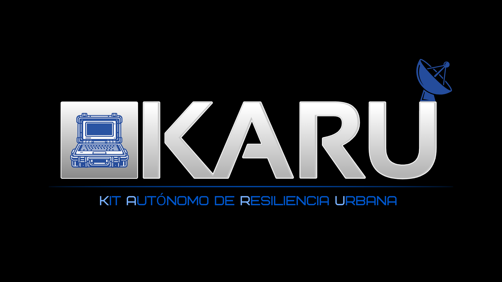

# KARU v1

KARU v1 es un cyberdeck portátil basado en Raspberry Pi diseñado para funcionar completamente offline.

Su objetivo es concentrar en un único dispositivo herramientas clave de información, navegación y comunicación, sin depender de conexión a internet.

---

## Enfoque

Es un dispositivo especializado.

Pensado para:
- consultar información crítica
- navegar mapas sin conexión
- acceder a documentación técnica
- trabajar con herramientas locales
- recibir señales de radio

Todo desde una interfaz simple y directa.

---

## Módulos principales

- **Mapa offline**  
  Visualización de mapas sin conexión mediante tiles locales.

- **Estacion meteorologica** 
  Informacion en tiempo real de la meteorologia en la zona.

- **Guías y documentación**  
  Biblioteca organizada de PDFs y contenido offline (Kiwix).

- **Asistente local**  
  Interfaz para consultar documentos almacenados en el dispositivo.

- **Radio (RTL-SDR)**  
  Recepción de señales VHF/UHF.

- **Sistema**  
  Panel con información básica del estado del dispositivo.

---

## Hardware base

- Raspberry Pi 5 (8GB)
- Pantalla táctil
- Almacenamiento SSD
- Módulo RTL-SDR
- Carcasa resistente (PelicanCase)

---

## Estado

En desarrollo.

Actualmente se está trabajando en:
- interfaz web
- visor de mapas offline
- organización de archivos
- estructura del sistema

---

## Filosofía

KARU v1 prioriza funcionalidad sobre estética.

Cada módulo debe tener un uso real.

Nada está ahí “porque sí”.

---

## Roadmap (resumen)

- [X] Interfaz funcional completa
- [ ] Mapas offline estables
- [X] Biblioteca de guías integrada
- [ ] Radio RX operativa
- [ ] Prototipo físico

---

Más detalles en la carpeta `/docs`.
