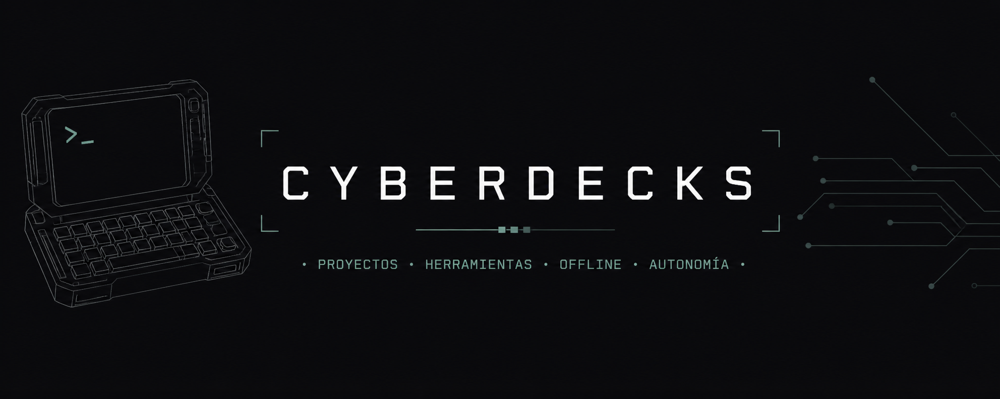

Repositorio donde se agrupan distintos proyectos de cyberdecks.

Cada carpeta contiene un dispositivo con un propósito concreto, junto con su documentación, decisiones técnicas y evolución.

## Proyectos

- **KARU** → cyberdeck basado en Raspberry Pi orientado a uso offline (en desarrollo)

---

Más detalles dentro de cada proyecto.
